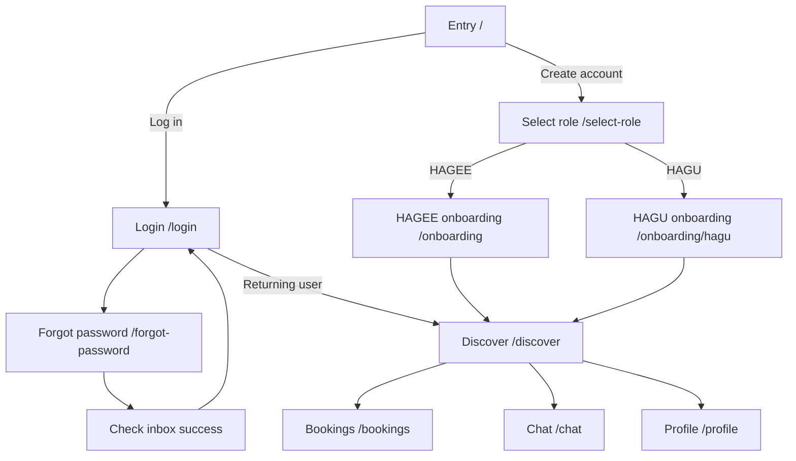
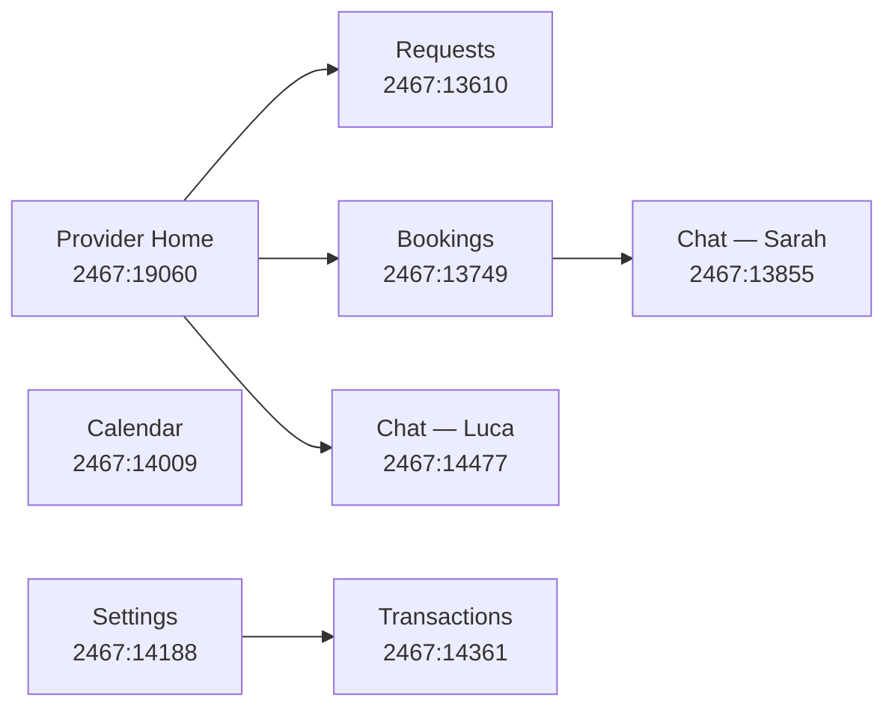

# Figma flow specification

Use this document as a checklist when completing flows in Figma. **Figma is the source of truth**; this repo is reference-only.

**Figma file:** [Hagu](https://www.figma.com/design/YCZ3EsQcr4rUfTgPutKj3E/Hagu)

---

## Flow overview

---

## 1. Entry (`/`)

| State | Description | Figma status |
|-------|-------------|--------------|
| Default | HAGU wordmark, tagline, Log in + Create account | To complete |
| Logged-in redirect | Skip — backend handles | N/A in Figma |

**CTAs:** Log in → Login; Create account → Select role

---

## 2. Auth

### Login (`/login`)

| State | Description | Figma status |
|-------|-------------|--------------|
| Default | Email, password, Sign in, Forgot password, Google | To complete |
| Error | Invalid credentials | To complete |
| Loading | Submit in progress | To complete |

**Reference in code:** [`app/login/page.tsx`](../app/login/page.tsx)

### Forgot password (`/forgot-password`)

| State | Description | Figma status |
|-------|-------------|--------------|
| Default | Email field, Send reset link | To complete |
| Success | Check your inbox | In code — document in Figma |

**Reference in code:** [`app/forgot-password/page.tsx`](../app/forgot-password/page.tsx)

---

## 3. Select role (`/select-role`)

| State | Description | Figma status |
|-------|-------------|--------------|
| None selected | Two role cards, disabled CTA | To complete |
| HAGEE selected | Card highlighted + checkmark | To complete |
| HAGU selected | Card highlighted + checkmark | To complete |

**Decision:** HAGEE → HAGEE onboarding; HAGU → HAGU onboarding

---

## 4. HAGEE onboarding (`/onboarding`)

**Figma reference frame:** `2393:9244`

| Step | Screen | States to design |
|------|--------|------------------|
| 1 | Intro carousel | Default |
| 2 | Create account | Empty, filled, terms unchecked/checked, Google |
| 3 | What are you looking for | Activities + vibes selected/unselected |
| 4 | About you | Photo placeholder, fields |
| 5 | Character traits | Min 3 selected |
| 6 | Success | All set, Start exploring |

---

## 5. HAGU onboarding (`/onboarding/hagu`)

**Figma flow frame:** `2424:11787`

| Step | Screen | Figma node (reference) | States to design |
|------|--------|------------------------|------------------|
| 1 | Intro | — | Default, carousel dots |
| 2 | Profile Basics | `2468:19975` | Empty, filled, photo upload |
| 3 | The Real You | — | Neighborhood, languages, character cards |
| 4 | Rates & Logistics | `2468:20300` | Hosting pills, rate inputs |
| 5 | Activity Menu | — | Toggles on/off, included vs extra |
| 6 | Availability | — | Days, time preferences |
| 7 | Identity (ID) | — | Before scan, after scan |
| 8 | Identity (Social) | — | Platform + handle |
| 9 | Get Paid | — | Stripe selected, PayPal |

---

## 6. HAGU Provider App (post-onboarding)

**Master flow frame:** [`2467:13479`](https://www.figma.com/design/YCZ3EsQcr4rUfTgPutKj3E/Hagu?node-id=2467-13479) — seven screens in the `Body` frame, left to right.

Structured data: [`lib/figma-flows.ts`](../lib/figma-flows.ts)

### Bottom navigation (Figma)

| Tab | Active on | Code route today |
|-----|-----------|------------------|
| Home | Provider Home, Requests | `/discover` |
| Bookings | Bookings | `/bookings` |
| Calendar | Calendar / Availability | **Not in code** — code uses `/chat` in this slot |
| Settings | Settings, Transactions | `/profile` |

### Screen inventory

| # | Screen | Figma node | Route (target) | States to design |
|---|--------|------------|----------------|------------------|
| — | Provider Home | `2467:19060` | `/discover` | Earnings card, next booking, requests banner |
| 1 | Requests | `2467:13610` | `/requests` | Pending cards, Decline / Accept, 24h deadline |
| 2 | Bookings | `2467:13749` | `/bookings` | Tabs: Requests · Upcoming · Past · Cancelled |
| 3 | Chat (active booking) | `2467:13855` | `/chat` | Pinned booking widget, bubbles, typing, input |
| 4 | Calendar / Availability | `2467:14009` | `/calendar` | Month grid, open/blocked/booked, time slots |
| 5 | Settings / Profile | `2467:14188` | `/profile` | Cover, stats, account/payout/preferences, log out |
| 6 | Transactions | `2467:14361` | `/profile/transactions` | Balance, withdraw, payout history |
| 7 | Chat (Luca M.) | `2467:14477` | `/chat` | Standard thread, online status, booking date |

### Discover (`/discover`) — HAGEE variant

| Variant | Description | Figma status |
|---------|-------------|--------------|
| HAGEE | Browse companions list | To complete |
| HAGU | Provider home (see above) | **`2467:19060`** — reference screen |

---

## 7. Global UI patterns (design system in Figma)

Document as components/variables in Figma:

| Pattern | Spec |
|---------|------|
| Canvas | `#FCFFFF` |
| Glass header | Back + HAGU logo + Close, `rounded-[32px]`, `bg-white/20` |
| Primary CTA | `#2D1012` pill, `h-64px`, `rounded-[32px]` |
| Input | `h-50px`, `rounded-[20px]`, label `#4A4A52` |
| Selected pill | `#1A1A1E` background |
| Accent | `#D0F1F0`, strong `#5BBFB5` |
| Bottom tab bar | Glass nav, 4 tabs (Home · Bookings · Calendar · Settings) |

**Code tokens:** [`lib/hagu-design.ts`](../lib/hagu-design.ts)

---

## 8. User journeys to prototype in Figma

Link screens with Figma prototyping for these three paths:

1. **New HAGEE** — Entry → Create account → HAGEE → Onboarding (6 steps) → Discover (HAGEE)
2. **New HAGU** — Entry → Create account → HAGU → Onboarding (9 steps) → Discover (Provider Home)
3. **Returning user** — Entry → Log in → Discover
4. **HAGU provider app** — Provider Home → Requests → Accept → Bookings → Chat → Calendar → Settings → Transactions

---

## Checklist before handoff

- [x] HAGU provider app flow frame (`2467:13479`) documented
- [ ] All screens above exist as frames in Figma
- [ ] Happy paths prototyped (3 journeys)
- [ ] Error/empty states for auth and forms
- [ ] Design variables match token doc
- [ ] HAGU reference screens (`2467`, `2468`) used as visual standard
- [ ] FigJam or flow diagram linked from Figma file cover
